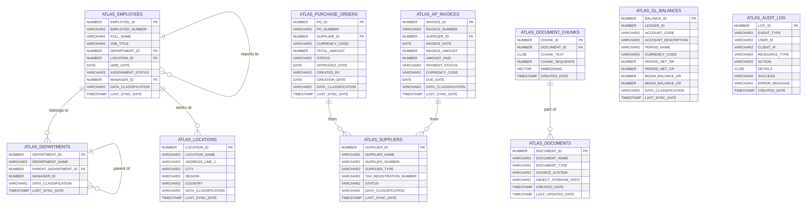

# Atlas on OCI - Database Schema Design

**Version:** 1.0
**Date:** January 30, 2026
**Author:** Manus AI

## 1. Introduction

This document details the "Simplified Schema" design for the Atlas platform on OCI. The primary objective of this schema is to cache essential data from Oracle Fusion (Finance and HR modules) within the OCI Autonomous Database (ATP). This local caching strategy enables fast data retrieval for the APEX dashboard and provides the foundation for the AI Vector Search capabilities required by the RAG implementation.

The schema design adheres to the NDMO Data Classification Policy V1 and incorporates security metadata directly into the table structures to support role-based access control (RBAC).

## 2. Design Principles

The schema design is guided by the following principles:

1.  **Simplification**: The schema abstracts the complexity of Oracle Fusion's native data model, presenting a flattened and more intuitive structure for the Atlas application.
2.  **Performance**: Tables are designed for fast read operations, with appropriate indexing to support the dashboard's query patterns.
3.  **Security by Design**: Each table includes metadata columns for data classification and access control, ensuring PDPL compliance is enforceable at the data layer.
4.  **Extensibility**: The schema is designed to be easily extended with new tables as more Fusion modules are integrated.

## 3. Core Schema Tables

The following sections describe the core tables of the simplified schema, grouped by functional area.

### 3.1. Human Resources (HR) Module

These tables cache employee and organizational data from Oracle Fusion HCM.

#### 3.1.1. `ATLAS_EMPLOYEES`

This table stores a simplified view of employee records, combining data from `PER_ALL_PEOPLE_F` and `PER_ALL_ASSIGNMENTS_M`.

| Column Name | Data Type | Constraints | Description |
|---|---|---|---|
| `EMPLOYEE_ID` | `NUMBER` | `PRIMARY KEY` | Unique identifier for the employee (maps to `PERSON_ID`). |
| `EMPLOYEE_NUMBER` | `VARCHAR2(30)` | `NOT NULL, UNIQUE` | Business key for the employee. |
| `FULL_NAME` | `VARCHAR2(240)` | `NOT NULL` | Full name of the employee. |
| `JOB_TITLE` | `VARCHAR2(120)` |  | Current job title. |
| `DEPARTMENT_ID` | `NUMBER` | `FOREIGN KEY` | Reference to `ATLAS_DEPARTMENTS`. |
| `LOCATION_ID` | `NUMBER` | `FOREIGN KEY` | Reference to `ATLAS_LOCATIONS`. |
| `HIRE_DATE` | `DATE` |  | Date of hire. |
| `ASSIGNMENT_STATUS` | `VARCHAR2(30)` |  | Current assignment status (e.g., ACTIVE, SUSPENDED). |
| `MANAGER_ID` | `NUMBER` | `FOREIGN KEY` | Reference to the employee's manager. |
| `DATA_CLASSIFICATION` | `VARCHAR2(20)` | `DEFAULT 'INTERNAL'` | NDMO data classification level. |
| `LAST_SYNC_DATE` | `TIMESTAMP` | `NOT NULL` | Timestamp of the last sync from Fusion. |

#### 3.1.2. `ATLAS_DEPARTMENTS`

This table stores organizational unit (department) information.

| Column Name | Data Type | Constraints | Description |
|---|---|---|---|
| `DEPARTMENT_ID` | `NUMBER` | `PRIMARY KEY` | Unique identifier for the department. |
| `DEPARTMENT_NAME` | `VARCHAR2(240)` | `NOT NULL` | Name of the department. |
| `PARENT_DEPARTMENT_ID` | `NUMBER` | `FOREIGN KEY` | Reference to the parent department for hierarchical structures. |
| `MANAGER_ID` | `NUMBER` |  | ID of the department manager. |
| `DATA_CLASSIFICATION` | `VARCHAR2(20)` | `DEFAULT 'INTERNAL'` | NDMO data classification level. |
| `LAST_SYNC_DATE` | `TIMESTAMP` | `NOT NULL` | Timestamp of the last sync from Fusion. |

#### 3.1.3. `ATLAS_LOCATIONS`

This table stores work location information.

| Column Name | Data Type | Constraints | Description |
|---|---|---|---|
| `LOCATION_ID` | `NUMBER` | `PRIMARY KEY` | Unique identifier for the location. |
| `LOCATION_NAME` | `VARCHAR2(60)` | `NOT NULL` | Name of the location. |
| `ADDRESS_LINE_1` | `VARCHAR2(240)` |  | Street address. |
| `CITY` | `VARCHAR2(60)` |  | City. |
| `REGION` | `VARCHAR2(60)` |  | Region or state. |
| `COUNTRY` | `VARCHAR2(60)` |  | Country. |
| `DATA_CLASSIFICATION` | `VARCHAR2(20)` | `DEFAULT 'PUBLIC'` | NDMO data classification level. |
| `LAST_SYNC_DATE` | `TIMESTAMP` | `NOT NULL` | Timestamp of the last sync from Fusion. |

### 3.2. Finance Module

These tables cache financial data from Oracle Fusion Financials.

#### 3.2.1. `ATLAS_SUPPLIERS`

This table stores supplier/vendor master data.

| Column Name | Data Type | Constraints | Description |
|---|---|---|---|
| `SUPPLIER_ID` | `NUMBER` | `PRIMARY KEY` | Unique identifier for the supplier. |
| `SUPPLIER_NAME` | `VARCHAR2(360)` | `NOT NULL` | Name of the supplier. |
| `SUPPLIER_NUMBER` | `VARCHAR2(30)` | `UNIQUE` | Business key for the supplier. |
| `SUPPLIER_TYPE` | `VARCHAR2(30)` |  | Type of supplier. |
| `TAX_REGISTRATION_NUMBER` | `VARCHAR2(50)` |  | Tax registration number. |
| `STATUS` | `VARCHAR2(30)` |  | Supplier status (e.g., ACTIVE, INACTIVE). |
| `DATA_CLASSIFICATION` | `VARCHAR2(20)` | `DEFAULT 'INTERNAL'` | NDMO data classification level. |
| `LAST_SYNC_DATE` | `TIMESTAMP` | `NOT NULL` | Timestamp of the last sync from Fusion. |

#### 3.2.2. `ATLAS_PURCHASE_ORDERS`

This table stores purchase order header information.

| Column Name | Data Type | Constraints | Description |
|---|---|---|---|
| `PO_ID` | `NUMBER` | `PRIMARY KEY` | Unique identifier for the purchase order. |
| `PO_NUMBER` | `VARCHAR2(20)` | `NOT NULL, UNIQUE` | Purchase order number. |
| `SUPPLIER_ID` | `NUMBER` | `FOREIGN KEY` | Reference to `ATLAS_SUPPLIERS`. |
| `CURRENCY_CODE` | `VARCHAR2(15)` |  | Currency of the PO. |
| `TOTAL_AMOUNT` | `NUMBER` |  | Total amount of the PO. |
| `STATUS` | `VARCHAR2(30)` |  | Approval status (e.g., APPROVED, PENDING). |
| `APPROVED_DATE` | `DATE` |  | Date of approval. |
| `CREATED_BY` | `VARCHAR2(100)` |  | User who created the PO. |
| `CREATION_DATE` | `DATE` |  | Date of creation. |
| `DATA_CLASSIFICATION` | `VARCHAR2(20)` | `DEFAULT 'RESTRICTED'` | NDMO data classification level. |
| `LAST_SYNC_DATE` | `TIMESTAMP` | `NOT NULL` | Timestamp of the last sync from Fusion. |

#### 3.2.3. `ATLAS_AP_INVOICES`

This table stores Accounts Payable invoice information.

| Column Name | Data Type | Constraints | Description |
|---|---|---|---|
| `INVOICE_ID` | `NUMBER` | `PRIMARY KEY` | Unique identifier for the invoice. |
| `INVOICE_NUMBER` | `VARCHAR2(50)` | `NOT NULL` | Invoice number. |
| `SUPPLIER_ID` | `NUMBER` | `FOREIGN KEY` | Reference to `ATLAS_SUPPLIERS`. |
| `INVOICE_DATE` | `DATE` |  | Date of the invoice. |
| `INVOICE_AMOUNT` | `NUMBER` |  | Total invoice amount. |
| `AMOUNT_PAID` | `NUMBER` |  | Amount already paid. |
| `PAYMENT_STATUS` | `VARCHAR2(30)` |  | Payment status (e.g., PAID, UNPAID). |
| `CURRENCY_CODE` | `VARCHAR2(15)` |  | Currency of the invoice. |
| `DUE_DATE` | `DATE` |  | Payment due date. |
| `DATA_CLASSIFICATION` | `VARCHAR2(20)` | `DEFAULT 'RESTRICTED'` | NDMO data classification level. |
| `LAST_SYNC_DATE` | `TIMESTAMP` | `NOT NULL` | Timestamp of the last sync from Fusion. |

#### 3.2.4. `ATLAS_GL_BALANCES`

This table stores General Ledger account balances for financial reporting.

| Column Name | Data Type | Constraints | Description |
|---|---|---|---|
| `BALANCE_ID` | `NUMBER` | `PRIMARY KEY` | Unique identifier for the balance record. |
| `LEDGER_ID` | `NUMBER` | `NOT NULL` | Ledger identifier. |
| `ACCOUNT_CODE` | `VARCHAR2(100)` | `NOT NULL` | Account code combination. |
| `ACCOUNT_DESCRIPTION` | `VARCHAR2(240)` |  | Description of the account. |
| `PERIOD_NAME` | `VARCHAR2(15)` | `NOT NULL` | Accounting period name. |
| `CURRENCY_CODE` | `VARCHAR2(15)` |  | Currency of the balance. |
| `PERIOD_NET_DR` | `NUMBER` |  | Net debit for the period. |
| `PERIOD_NET_CR` | `NUMBER` |  | Net credit for the period. |
| `BEGIN_BALANCE_DR` | `NUMBER` |  | Beginning balance debit. |
| `BEGIN_BALANCE_CR` | `NUMBER` |  | Beginning balance credit. |
| `DATA_CLASSIFICATION` | `VARCHAR2(20)` | `DEFAULT 'RESTRICTED'` | NDMO data classification level. |
| `LAST_SYNC_DATE` | `TIMESTAMP` | `NOT NULL` | Timestamp of the last sync from Fusion. |

### 3.3. AI Vector Search Support

These tables support the RAG (Retrieval-Augmented Generation) implementation.

#### 3.3.1. `ATLAS_DOCUMENTS`

This table stores metadata for documents used in the RAG knowledge base.

| Column Name | Data Type | Constraints | Description |
|---|---|---|---|
| `DOCUMENT_ID` | `NUMBER` | `PRIMARY KEY` | Unique identifier for the document. |
| `DOCUMENT_NAME` | `VARCHAR2(255)` | `NOT NULL` | Name of the document. |
| `DOCUMENT_TYPE` | `VARCHAR2(50)` |  | Type of document (e.g., POLICY, PROCEDURE, FAQ). |
| `SOURCE_SYSTEM` | `VARCHAR2(50)` |  | Source system (e.g., FUSION_DOCS, INTERNAL_KB). |
| `OBJECT_STORAGE_PATH` | `VARCHAR2(500)` |  | Path to the document in OCI Object Storage. |
| `CREATED_DATE` | `TIMESTAMP` | `NOT NULL` | Date the document was added. |
| `LAST_UPDATED_DATE` | `TIMESTAMP` |  | Date the document was last updated. |

#### 3.3.2. `ATLAS_DOCUMENT_CHUNKS`

This table stores chunked text from documents along with their vector embeddings for semantic search.

| Column Name | Data Type | Constraints | Description |
|---|---|---|---|
| `CHUNK_ID` | `NUMBER` | `PRIMARY KEY` | Unique identifier for the chunk. |
| `DOCUMENT_ID` | `NUMBER` | `FOREIGN KEY` | Reference to `ATLAS_DOCUMENTS`. |
| `CHUNK_TEXT` | `CLOB` | `NOT NULL` | The text content of the chunk. |
| `CHUNK_SEQUENCE` | `NUMBER` | `NOT NULL` | Sequence number of the chunk within the document. |
| `EMBEDDING` | `VECTOR(384)` |  | Vector embedding for semantic search (dimension depends on model). |
| `CREATED_DATE` | `TIMESTAMP` | `NOT NULL` | Date the chunk was created. |

### 3.4. Audit and Logging

#### 3.4.1. `ATLAS_AUDIT_LOG`

This table stores audit logs for all significant operations within the Atlas platform.

| Column Name | Data Type | Constraints | Description |
|---|---|---|---|
| `LOG_ID` | `NUMBER` | `PRIMARY KEY` | Unique identifier for the log entry. |
| `EVENT_TYPE` | `VARCHAR2(50)` | `NOT NULL` | Type of event (e.g., LOGIN, QUERY, DATA_ACCESS). |
| `USER_ID` | `VARCHAR2(100)` |  | User who performed the action. |
| `CLIENT_IP` | `VARCHAR2(50)` |  | IP address of the client. |
| `RESOURCE_TYPE` | `VARCHAR2(50)` |  | Type of resource accessed. |
| `ACTION` | `VARCHAR2(100)` |  | Action performed. |
| `DETAILS` | `CLOB` |  | JSON details of the event. |
| `SUCCESS` | `VARCHAR2(1)` | `DEFAULT 'Y'` | Whether the action was successful. |
| `ERROR_MESSAGE` | `VARCHAR2(4000)` |  | Error message if the action failed. |
| `CREATED_DATE` | `TIMESTAMP` | `NOT NULL` | Timestamp of the event. |

## 4. Entity Relationship Diagram

The following diagram illustrates the relationships between the core tables in the simplified schema.

## 5. SQL DDL Script

The complete DDL script for creating the simplified schema is provided in the `schema_ddl.sql` file within the `provisioning` directory.
