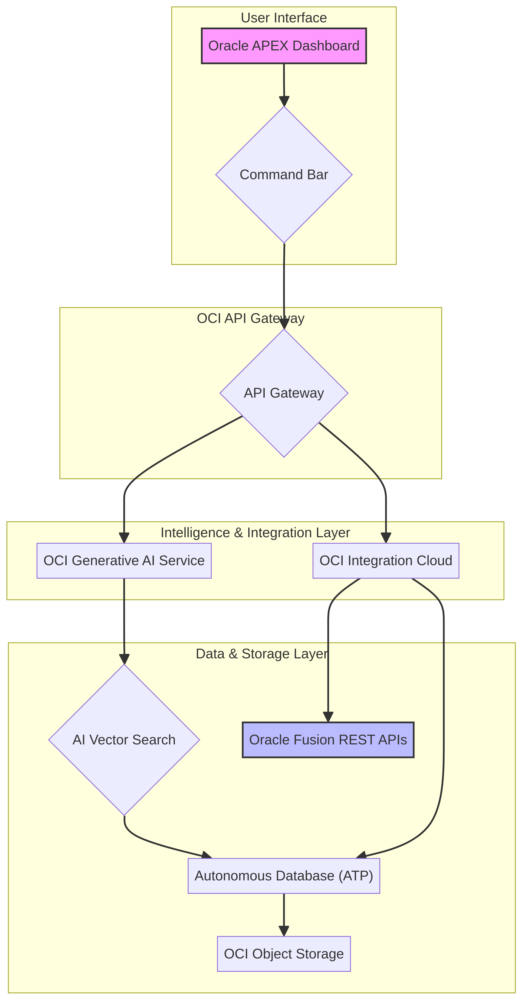

# Atlas on OCI - Infrastructure Architecture

**Version:** 1.0
**Date:** January 30, 2026
**Author:** Manus AI

## 1. Introduction

This document outlines the infrastructure architecture for deploying the Atlas project on Oracle Cloud Infrastructure (OCI). The design prioritizes security, scalability, and maintainability by leveraging OCI-native services as mandated by the project's core principles. The goal is to create a robust foundation for the AI-driven Oracle Fusion interface built with Oracle APEX.

This architecture adapts the business and functional requirements from the original Atlas PRD (v2.1) to a pure OCI-native stack, replacing the Alibaba Cloud components with their OCI equivalents.

## 2. Core OCI Components

The architecture is built upon a selection of OCI-native services to ensure seamless integration, performance, and security. The following table details the core components and their respective roles within the Atlas platform.

| OCI Service | Role in Atlas Architecture | Justification |
|---|---|---|
| **OCI Compartments** | Resource Isolation & Governance | Provides a logical container to isolate all Atlas resources, simplifying management and access control. |
| **Autonomous Database (ATP)** | Primary Database & APEX Host | Serves as the foundation for the Simplified Schema, hosts the APEX application, and includes built-in AI Vector Search capabilities. |
| **Oracle APEX** | Application Framework | Enables rapid development of the minimalist, high-performance Atlas dashboard and Command Bar interface, as required by the PRD. |
| **OCI API Gateway** | Secure API Management | Acts as the single entry point for all API calls, enforcing security policies, authentication, and rate limiting for interactions with Oracle Fusion. |
| **OCI Integration Cloud (OIC)** | Integration & Orchestration | Facilitates complex workflows between APEX, Fusion REST APIs, and OCI Generative AI, abstracting the integration logic from the frontend. |
| **OCI Generative AI** | Intelligence Layer | Powers the natural language processing for the Command Bar, translating user commands into API actions and implementing the RAG pipeline. |
| **AI Vector Search** | Semantic Querying | Integrated within the Autonomous Database, it enables semantic search over cached Fusion data and documentation for the RAG implementation. |
| **OCI Object Storage** | Document & Log Storage | Provides a durable and cost-effective solution for storing Fusion documentation for the RAG knowledge base, as well as audit logs and backups. |
| **OCI IAM** | Identity & Access Control | Manages authentication and authorization for all users and services, ensuring adherence to the principle of least privilege. |
| **OCI Networking (VCN)** | Secure Network Environment | Creates a private, secure virtual cloud network to host all infrastructure components, with subnets and security lists to control traffic flow. |

## 3. Architecture Diagram

The following diagram illustrates the high-level architecture of the Atlas platform on OCI.

### 3.1. Workflow and Data Flow

1.  **User Interaction**: The user interacts with the **Oracle APEX Dashboard**, which features a **Command Bar** for entering natural language queries.
2.  **API Gateway**: The Command Bar sends the user's query to the **OCI API Gateway**. The gateway authenticates the request and routes it to the appropriate backend service.
3.  **Intelligence Layer**: The request is forwarded to the **OCI Generative AI Service**, which analyzes the natural language query. For complex queries or those requiring data from Oracle Fusion, the request is passed to **OCI Integration Cloud**.
4.  **RAG and Data Retrieval**: The Generative AI service utilizes **AI Vector Search** within the Autonomous Database to find relevant information from cached Fusion data or documents stored in **OCI Object Storage**. OCI Integration Cloud directly queries the **Oracle Fusion REST APIs** for real-time data.
5.  **Data Aggregation**: The **Autonomous Database (ATP)** serves as the central data hub, storing the simplified schema, caching data from Fusion, and managing the vector search index. OCI Integration Cloud orchestrates the data flow between Fusion and the ATP.
6.  **Response Generation**: The Generative AI service synthesizes the information retrieved from the various sources and generates a natural language response.
7.  **Response to User**: The response is sent back through the API Gateway to the APEX dashboard and displayed to the user.
